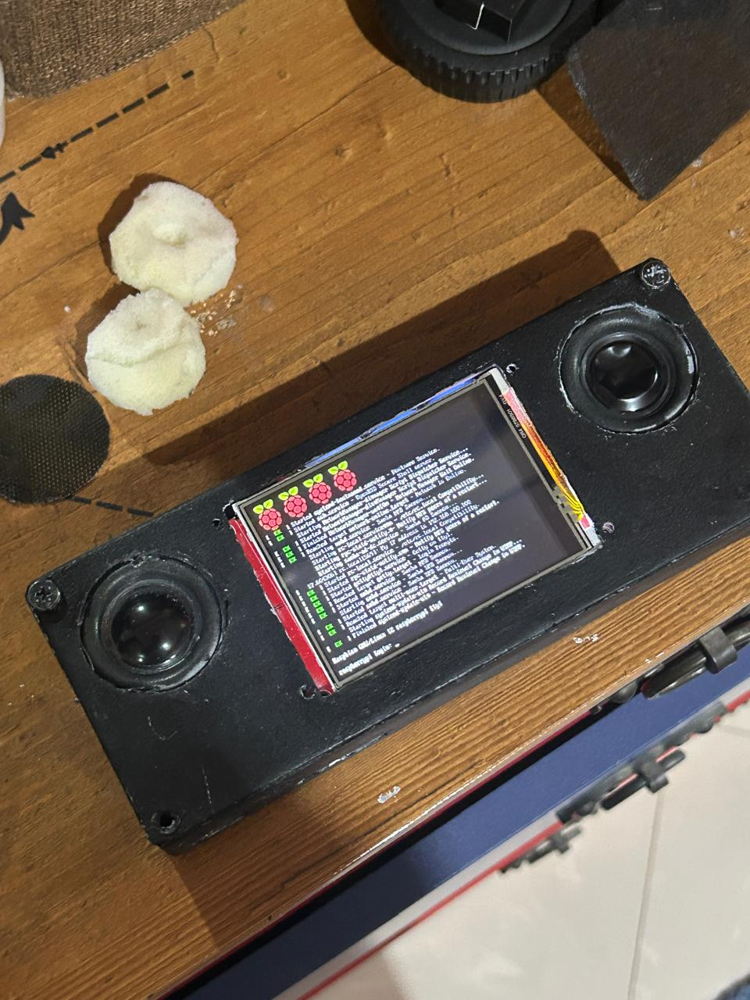
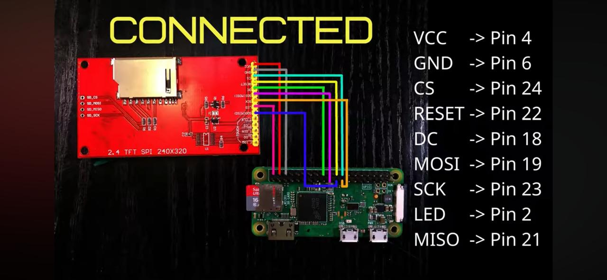

# ScrapPi
a minimal computer assembled from salvaged parts, running a custom Angry Oxide build along with other builds on Raspberry Pi hardware. Includes setup scripts, environment tuning, and I/O integrations.
Modes

<p align="center">
  
</p>

## Materials

- **Raspberry Pi Zero 2**
- **Case:** 3D-printed PLA shell (custom model)
- **Speakers:** 2× salvaged drivers from a broken sound system
- **Audio Boards:** 2× MAX98357 amplifier boards
- **Power:** 4× 18650 cells + charging module pulled from an old power bank
- **Display:** repurposed small LCD screen (ili9341-based)
- **Miscellaneous:** capacitors, resistors, perfboard, and  
  5× **HiLetgo EI14/EI-14 Audio Coupling Isolation Transformers** (600:600, 1:1)

This build aims to maximize reuse of discarded electronics, turning leftovers into a functional, portable multi-mode computer.

---
## Features:

Music Mode: Bash-based streaming setup with lightweight CLI audio tools (Mopidy, MPD, etc.).

Game Mode: RetroPie or custom emulator image optimized for small hardware.

Art Mode: Loops local GIFs/videos on boot — sort of a digital kinetic sculpture.

Oxide Mode: Runs the Angry Oxide kernel build for low-level experimentation.

---

## Software & Automation

Built around reproducible scripts for imaging, setup, and environment switching.  
Uses heavy **Bash automation** to handle:
- Initial SD card image creation  
- Mode selection and service toggling via systemd units  
- Display driver setup (fbcp-ili9341 overlay)  
- Audio routing through ALSA configuration  
- Boot-time behaviors for each “mode” (Music, Game, Art, Oxide)

The goal is to treat the same hardware as multiple personalities — switchable by software rather than solder.

---

## Hardware Overview

Focuses on assembling and wiring salvaged components into a cohesive board layout.  
Includes power routing, amplifier isolation using coupling transformers, and LCD display interfacing through SPI.  
The PLA shell and internal frame were modeled for tight tolerances around the reused parts.  
Hardware section will include:
- Wiring diagrams (speaker, power, screen)
- Voltage and current management notes
- 3D-printable case design files and mounting details

---

## Acknowledgments

Massive thanks to:
- The maintainers of the [fbcp-ili9341](https://github.com/juj/fbcp-ili9341) project for their excellent driver and documentation.  
- The creators of the wiring and pinout diagrams here

This project builds on their work — the community around small-screen Raspberry Pi hardware has been invaluable.

---

## Build Overview

The ScrapPi project is split into two main phases: **hardware assembly** and **software configuration**.  
Both parts work together to turn salvaged components into a fully modular, multi-mode device.

### Hardware Assembly
The hardware portion focuses on repurposing and wiring together all the physical components: the screen, power system, and audio setup.

It’s built in three major stages:
1. **Display Setup** — connecting the small ILI9341-based SPI screen using the [fbcp-ili9341](https://github.com/juj/fbcp-ili9341) driver for output mirroring.  
2. **Power and Charging System** — wiring 4× 18650 cells into a powerbank module with charging management, then routing stable voltage to the Pi and amplifiers.  
3. **Audio System** — integrating the dual MAX98357 boards with isolation transformers for clear stereo output through salvaged speakers.

Each of these stages will have its own section with wiring diagrams, photos, and notes on reuse challenges and part behavior.

### Software Configuration
Once the hardware is complete, the next stage is setting up the software environments that define the system’s *modes*.  
All configurations are done through **Bash scripting** and lightweight system services.

The operating base is **Raspberry Pi OS Bullseye**, with additional software stacks layered on top:

- **Volumio** for Music Mode (streaming, playback, and network audio)
- **RetroPie** for Game Mode (optimized emulation for low-power hardware)
- **Custom Bash/MPV setup** for Art Mode (auto-looping local videos and GIFs)
- **Angry Oxide build** for Oxide Mode (kernel-level experimentation)

Scripts manage switching between these environments by enabling or disabling relevant services at boot.

This structure reflects the project’s philosophy: *same hardware, different identities — purely defined by software.*

### Hardware Assembly
The following diagram shows the exact pin connections used between the display module and the Raspberry Pi:

<p align="center">
  <br/>
  <i>SPI wiring layout for the ILI9341 display module</i>
</p>

| Display Pin | Raspberry Pi Pin | Function |
|--------------|------------------|-----------|
| VCC          | 4 (5V)           | Power supply |
| GND          | 6 (GND)          | Ground |
| CS           | 24               | SPI chip select |
| RESET        | 22               | Display reset |
| DC           | 18               | Data/command select |
| MOSI         | 19               | SPI data out |
| SCK          | 23               | SPI clock |
| LED          | 2 (5V)           | Backlight power |
| MISO         | 21               | SPI data in |

---

### Driver Setup (fbcp-ili9341)
# Note: For the different purposes the installed OS versions maybe slightly different however for now we will work on **Raspberry Pi OS (32-bit), based on Debian 11 "Bullseye"**


Once the wiring is complete, the next step is configuring the Pi to use the display as its framebuffer output.
**Install dependencies and setting up the screen: (You will be using that for any of the different formatted )**
   ```bash
   sudo apt update
    sudo apt-get install cmake
    sudo git clone https://github.com/juj/fbcp-ili9341
    cd fbcp-ili9341
    sudo mkdir build
    cd build
    sudo cmake -DILI9341=ON -DGPIO_TFT_DATA_CONTROL=22 -DGPIO_TFT_RESET_PIN=27 -DSPI_BUS_CLOCK_DIVISOR=6 -DSTATISTICS=0 ..
    sudo make -j
   sudo nano /etc/rc.local
   // "sudo /home/pi/fbcp-ili9341/build/fbcp-ili9341 &"
```

**Setting up /boot/config.txt (THIS IS ALSO IMPORTANT FOR LATER ON)**

   ```bash
    sudo nano /boot/config.txt
```
   ```bash
    dtparam=i2s=on

dtparam=audio=on
gpio=12,13,a5
audio_pwm_mode=2
dtoverlay=audremap,pins_12_13

"remove overscan scale=1"

disable_overscan=1

hdmi_force_hotplug=1

hdmi_cvt=320 240 60 5
hdmi_group =2
hdmi_mode=87
hdmi_drive=2
```

