# ScrapPi
a minimal computer assembled from salvaged parts, running a custom Angry Oxide build along with other builds on Raspberry Pi hardware. Includes setup scripts, environment tuning, and I/O integrations.
Modes

<p align="center">
  
</p>

## Materials

- **Raspberry Pi Zero 2**
- **Case:** 3D-printed PLA shell (custom model)
- **Speakers:** 2× salvaged drivers from a broken sound system
- **Audio Boards:** 2× MAX98357 amplifier boards
- **Power:** 4× 18650 cells + charging module pulled from an old power bank
- A simple switch for power on and off
- Boost converter 5V
- **Display:** repurposed small LCD screen (ili9341-based)
- **Miscellaneous:** capacitors, resistors, perfboard, and  
- **HiLetgo EI14/EI-14 Audio Coupling Isolation Transformers** (600:600, 1:1)
- **Keyboard:** Wireless Mini Keyboard Remote Control Touchpad Mouse Combo Controller with RGB Backlit for Smart TV Android TV Box PC IPTTV 2.4GHz (for typing on the computer)
- **GamePad:** Ipega Bluetooth controller (for retropie to play games)
- TP-Link AC600 USB WiFi Adapter for PC (Archer T2U Plus) **this is for Angry Oxide**
- USB 2.0 Micro USB Male to USB Female (To adapt the AC600 to the Pi Zero)

This build aims to maximize reuse of discarded electronics, turning leftovers into a functional, portable multi-mode computer.

---
## Features:

Music Mode: Bash-based streaming setup with lightweight CLI audio tools (Mopidy, MPD, etc.).

Game Mode: RetroPie or custom emulator image optimized for small hardware.

Art Mode: Loops local GIFs/videos on boot — sort of a digital kinetic sculpture.

Oxide Mode: Runs the Angry Oxide kernel build for low-level experimentation.

---

## Software & Automation

Built around reproducible scripts for imaging, setup, and environment switching.  
Uses heavy **Bash automation** to handle:
- Initial SD card image creation  
- Mode selection and service toggling via systemd units  
- Display driver setup (fbcp-ili9341 overlay)  
- Audio routing through ALSA configuration  
- Boot-time behaviors for each “mode” (Music, Game, Art, Oxide)

The goal is to treat the same hardware as multiple personalities — switchable by software rather than solder.

---

## Hardware Overview

Focuses on assembling and wiring salvaged components into a cohesive board layout.  
Includes power routing, amplifier isolation using coupling transformers, and LCD display interfacing through SPI.  
The PLA shell and internal frame were modeled for tight tolerances around the reused parts.  
Hardware section will include:
- Wiring diagrams (speaker, power, screen)
- Voltage and current management notes
- 3D-printable case design files and mounting details

---

## Acknowledgments

Massive thanks to:
- The maintainers of the [fbcp-ili9341](https://github.com/juj/fbcp-ili9341) project for their excellent driver and documentation.  
- The creators of the wiring and pinout diagrams here

This project builds on their work — the community around small-screen Raspberry Pi hardware has been invaluable.

---

## Build Overview

The ScrapPi project is split into two main phases: **hardware assembly** and **software configuration**.  
Both parts work together to turn salvaged components into a fully modular, multi-mode device.

### Hardware Assembly
The hardware portion focuses on repurposing and wiring together all the physical components: the screen, power system, and audio setup.

It’s built in three major stages:
1. **Display Setup** — connecting the small ILI9341-based SPI screen using the [fbcp-ili9341](https://github.com/juj/fbcp-ili9341) driver for output mirroring.  
2. **Power and Charging System** — wiring 4× 18650 cells into a powerbank module with charging management, then routing stable voltage to the Pi and amplifiers.  
3. **Audio System** — integrating the dual MAX98357 boards with isolation transformers for clear stereo output through salvaged speakers.

Each of these stages will have its own section with wiring diagrams, photos, and notes on reuse challenges and part behavior.

### Software Configuration
Once the hardware is complete, the next stage is setting up the software environments that define the system’s *modes*.  
All configurations are done through **Bash scripting** and lightweight system services.

The operating base is **Raspberry Pi OS Bullseye**, with additional software stacks layered on top:

- **Volumio** for Music Mode (streaming, playback, and network audio)
- **RetroPie** for Game Mode (optimized emulation for low-power hardware)
- **Custom Bash/MPV setup** for Art Mode (auto-looping local videos and GIFs)
- **Angry Oxide build** for Oxide Mode (kernel-level experimentation)

Scripts manage switching between these environments by enabling or disabling relevant services at boot.

This structure reflects the project’s philosophy: *same hardware, different identities — purely defined by software.*

### Hardware Assembly
The following diagram shows the exact pin connections used between the display module and the Raspberry Pi:

<p align="center">
  <br/>
  <i>SPI wiring layout for the ILI9341 display module</i>
</p>

| Display Pin | Raspberry Pi Pin | Function |
|--------------|------------------|-----------|
| VCC          | 4 (5V)           | Power supply |
| GND          | 6 (GND)          | Ground |
| CS           | 24               | SPI chip select |
| RESET        | 22               | Display reset |
| DC           | 18               | Data/command select |
| MOSI         | 19               | SPI data out |
| SCK          | 23               | SPI clock |
| LED          | 2 (5V)           | Backlight power |
| MISO         | 21               | SPI data in |

---

### Driver Setup (fbcp-ili9341)
# Note: For the different purposes the installed OS versions maybe slightly different however for now we will work on **Raspberry Pi OS (32-bit), based on Debian 11 "Bullseye"**


Once the wiring is complete, the next step is configuring the Pi to use the display as its framebuffer output.
**Install dependencies and setting up the screen: (You will be using that for any of the different formatted )**
   ```bash
   sudo apt update
    sudo apt-get install cmake
    sudo git clone https://github.com/juj/fbcp-ili9341
    cd fbcp-ili9341
    sudo mkdir build
    cd build
    sudo cmake -DILI9341=ON -DGPIO_TFT_DATA_CONTROL=22 -DGPIO_TFT_RESET_PIN=27 -DSPI_BUS_CLOCK_DIVISOR=6 -DSTATISTICS=0 ..
    sudo make -j
   sudo nano /etc/rc.local
   // "sudo /home/pi/fbcp-ili9341/build/fbcp-ili9341 &"
```

**Setting up /boot/config.txt (THIS IS ALSO IMPORTANT FOR LATER ON)**

   ```bash
    sudo nano /boot/config.txt
```
   ```bash
    dtparam=i2s=on

dtparam=audio=on
gpio=12,13,a5
audio_pwm_mode=2
dtoverlay=audremap,pins_12_13

"remove overscan scale=1"

disable_overscan=1

hdmi_force_hotplug=1

hdmi_cvt=320 240 60 5
hdmi_group =2
hdmi_mode=87
hdmi_drive=2
```

Perfect — that’ll fit beautifully as a small “Gamepad + Bluetooth Setup” section right after your Art Mode or setup section. Here’s a **GitHub-friendly version** that matches your visual style and formatting (centered images, nice inline code blocks, and everything clean for your README):

---

## Gamepad + Bluetooth Setup

The ScrapPi can connect to **Bluetooth gamepads and keyboards** for portable control or retro-style input.
Installing the Bluetooth stack ensures smooth pairing with most modern wireless devices.

<p align="center">
  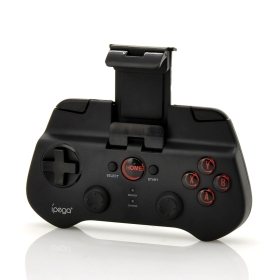
  <br/>
  <i>Pairing a Bluetooth gamepad and keyboard to the ScrapPi.</i>
</p>

### Install Bluetooth Utilities

```bash
sudo apt update
sudo apt install bluetooth blueman bluez -y
sudo systemctl enable bluetooth
sudo systemctl start bluetooth
```

Once installed, you can open the **Bluetooth Manager (Blueman)** via the Raspberry Pi desktop
or pair manually through the terminal:

```bash
bluetoothctl
```

Then inside the prompt:

```
power on
agent on
scan on
pair XX:XX:XX:XX:XX:XX
trust XX:XX:XX:XX:XX:XX
connect XX:XX:XX:XX:XX:XX
```

*(Replace the Xs with your device’s MAC address shown during scan.)*

After connecting, your controller or keyboard should work seamlessly across all modes —
from Angry Oxide and Art Mode to emulators or terminal control.

---


## Power System Integration

The second stage of the build is powering the ScrapPi using salvaged cells and a modular charging circuit.  
This section covers how the 18650 batteries are connected, managed, and safely routed to the Raspberry Pi through a charge-protection setup.

---

### Overview

The power system is built from **four 18650 lithium cells** recovered from an old power bank.  
They’re wired **in series** for higher voltage output and paired with a **charging protection module** to regulate current and prevent over-discharge.

A small **toggle switch** between the output and the Raspberry Pi allows manual power control — effectively acting as a hardware “on/off” without disconnecting the charger.

All power and ground connections were **soldered directly to the back of the Raspberry Pi board**, bypassing the GPIO header for a cleaner and more permanent connection.

---

### Wiring Reference

<p align="center">
  <br/>
  <i>Battery, charging, and power routing layout for the Raspberry Pi Zero</i>
</p>

**Components used:**
- 4× 18650 lithium-ion cells (salvaged)
- 1× TP4056 charging module (with micro-USB input and protection)
- 1× DC boost converter (output set to 5V)
- 1× toggle power switch
- Misc. wires and heatshrink for insulation

---

### Connection Flow

| Component | Connection | Description |
|------------|-------------|-------------|
| 18650 Battery Pack | → TP4056 (B+ / B−) | Provides raw power input to the charging module |
| TP4056 OUT+ / OUT− | → DC Boost Converter IN+ / IN− | Boosts voltage to stable 5V output |
| Boost Converter OUT+ / OUT− | → Toggle Switch → Pi 5V / GND | Sends regulated power to the Pi via switch |
| TP4056 Micro-USB | Input for charging | Charges the 18650 cells safely |

This configuration allows **charging and powering the Pi simultaneously**, similar to how a power bank circuit behaves.  
The Pi receives clean 5V from the boost converter, while the TP4056 manages the charging of the cells independently.

---

### Notes

- Always verify the boost converter output before connecting to the Pi (target: **5.0V ± 0.1V**).  
- The switch is wired **on the positive (5V) line** between the converter and Pi — breaking the circuit cleanly when off.  
- The TP4056 board includes **overcharge, overdischarge, and short protection**, but using a **4-cell balanced charge board** is recommended if expanding the pack.
- Soldering directly to the Pi’s back power pads avoids header clutter but requires steady hands — ensure no bridging on 5V/GND traces.

---

Once the power system is stable and charging properly, the next section sets up the **Audio System** — integrating the MAX98357 boards and isolation transformers for stereo output.

## Audio System Integration

The third stage of the build focuses on delivering clean, amplified audio output from the Raspberry Pi — without the interference or static that often plagues compact power setups.  
This was one of the most technically challenging portions of the ScrapPi project, requiring several tests and revisions to achieve noise-free playback.

---

### Overview

The audio system uses the **MAX98357A I2S amplifier board** paired with an **audio isolation transformer** between the Pi’s output and the amplifier input.  
This configuration eliminates ground noise and distortion while maintaining signal clarity and gain strength.  

Two boards can be used for stereo output, but this setup documents a **single-channel build** as proof of concept.  

---

### Wiring Reference

<p align="center">
  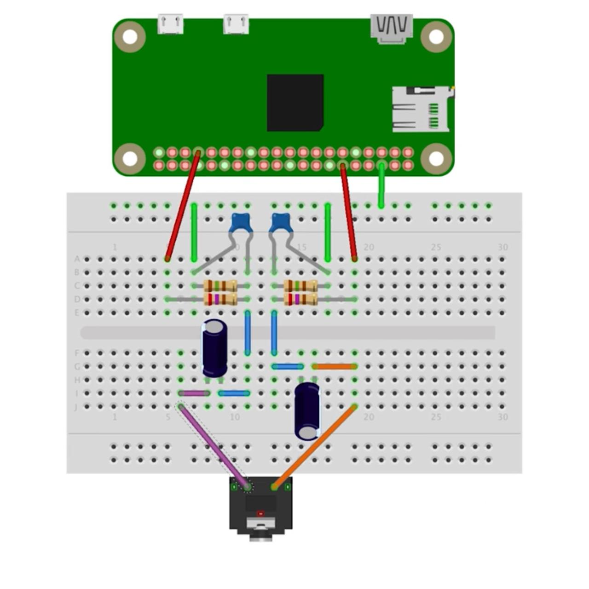<br/>
  <i>Raspberry Pi audio isolation stage using a transformer and passive filtering</i>
</p>

<p align="center">
  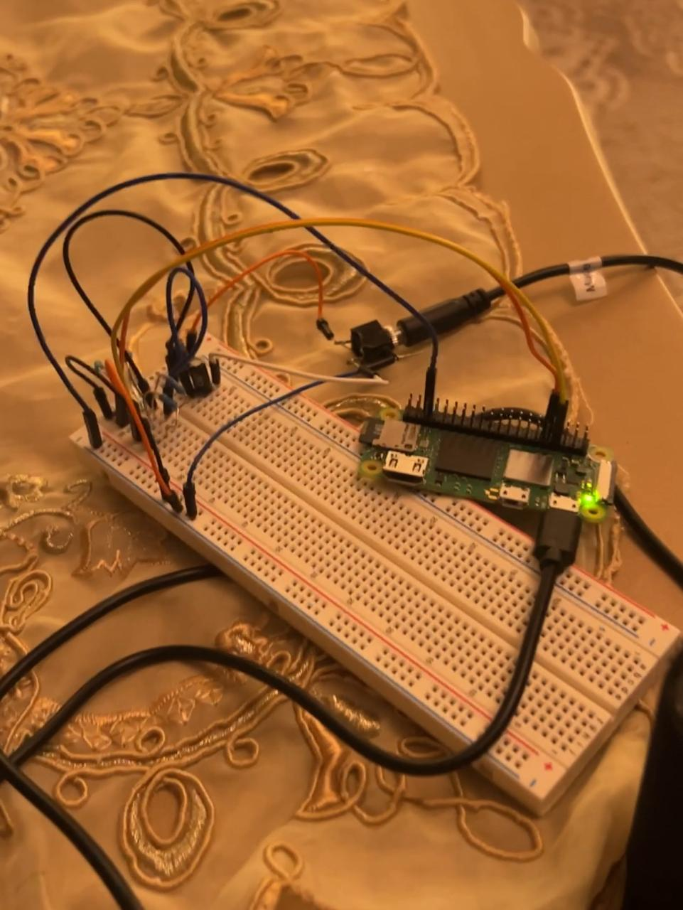<br/>
  <i>Testing it out on the breadboard</i>
</p>

<p align="center">
  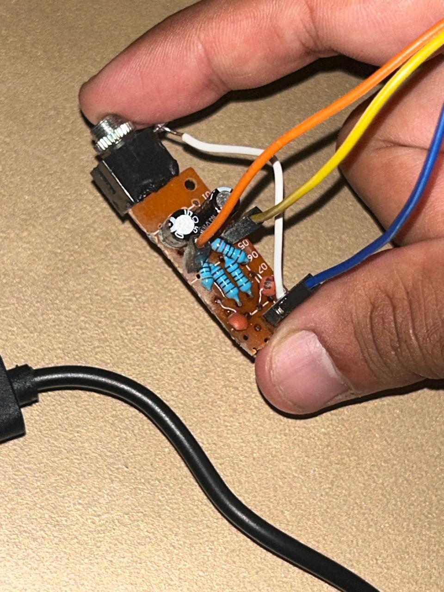<br/>
  <i>moved it onto a small pcb board</i>
</p>

The signal from the Pi passes through a small **audio transformer** (built on a breadboard) before reaching the amplifier.  
This stage filters DC offset and separates the power ground from the audio ground — a crucial step for avoiding hum and static.

<p align="center">
  <br/>
  <i>THIS IS PLACED IN BETWEEN THE BEFORE AND THE FOLLOWING DIAGRAM</i>
</p>

<p align="center">
  <br/>
  <i>MAX98357A I2S amplifier wiring and speaker connection layout (The power pin maybe moved to the switch itself since in most cases the Pi Zero struggles delivering)</i>
</p>

**Components used:**
- 1× MAX98357A I2S amplifier board  
- 1× Audio isolation transformer  
- 1× 4Ω or 8Ω speaker  
- Capacitors and resistors for signal smoothing  
- Breadboard or perfboard for prototyping connections  

---

### Connection Flow

| Component | Connection | Description |
|------------|-------------|-------------|
| Pi Audio Output | → Transformer Input | Isolates and filters the raw signal |
| Transformer Output | → MAX98357A DIN | Feeds clean digital signal into amplifier |
| Pi GPIO 12, 13, 18 | → MAX98357A LRC, BCLK, DIN | Handles I2S digital audio lines |
| 5V / GND | → MAX98357A Vin / GND | Powers the amplifier |
| MAX98357A Out+ / Out− | → Speaker | Drives the connected speaker directly |

---

### Notes on Noise Reduction

Originally, connecting the MAX board directly to the Pi produced constant background hiss and hum.  
After extensive troubleshooting, introducing a small **audio isolation transformer** before the amplifier entirely resolved the issue — delivering crystal-clear sound even under load.  

This single change made a massive difference, proving that **ground isolation is critical in mixed-voltage systems** like the ScrapPi.  
Future stereo configurations can simply mirror this layout with two isolated channels.

---

### Final Results

After wiring the transformer and amplifier correctly:
- Audio output was clean, with zero noticeable interference       **Note the audio pins setup in the past config is pins 12 and 13** 
- Volume and tone quality remained stable across modes (Volumio, RetroPie, etc.)  
- Power draw from the MAX board stayed minimal (< 250mA peak)

<p align="center">
  <i>This fix was one of the most satisfying discoveries of the entire build.</i>
</p>

---

Once audio performance was stabilized, the next and final phase involved configuring the **software environments** and scripting how the ScrapPi switches between its multiple functional modes.

## Case & Physical Setup

Before diving into the software configuration, the Angryoxide build needed a solid physical foundation — a compact, self-contained shell to hold all the scavenged hardware together.

<p align="center">
  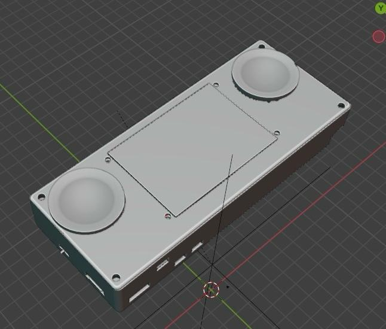<br/>
  <i>The case was 3D-printed using **PLA filament** and designed to house all key components in layers:.</i>
</p>


- The **Raspberry Pi Zero 2** and **TFT display** mounted at the front
- The **18650 battery pack** and **charging module** fitted underneath
- The **audio boards and transformers** tucked neatly along the sides
- A small **toggle switch** and **charging port** accessible from the back

<p align="center">
  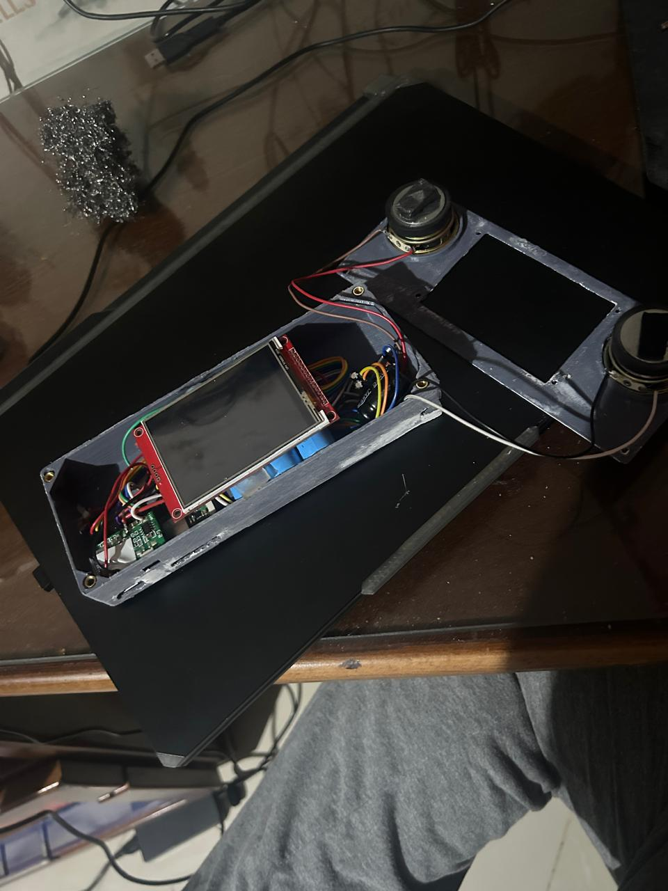<br/>
  <i>Internal layout during assembly — wiring, battery pack, and display routing.</i>
</p>

All major connections were soldered directly for stability and minimal noise.  
The design kept modularity in mind, allowing each board (power, audio, display) to be replaced independently if needed.

Once the internals were finalized, the case was closed and the screen powered up through the switch — confirming correct power routing and display function.

<p align="center">
  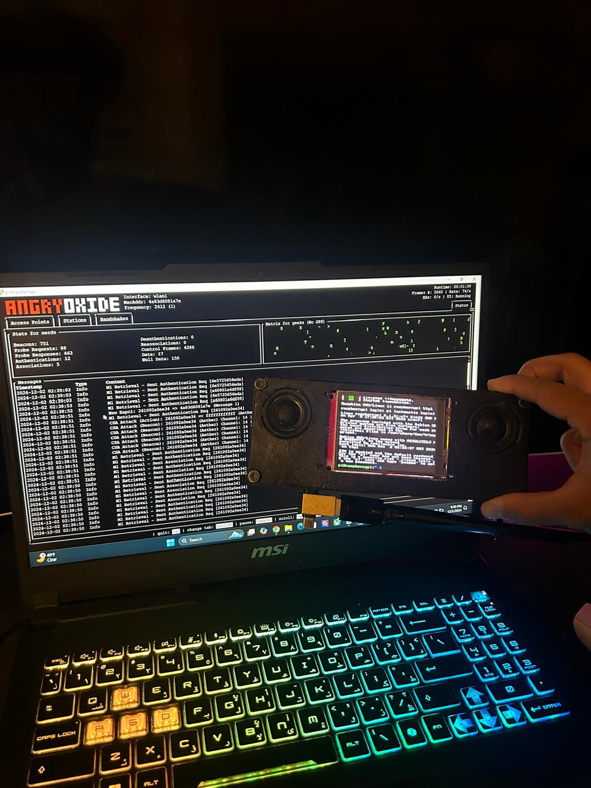<br/>
  <i>Final enclosed build — compact, modular, and running the Angryoxide environment.</i>
</p>

This enclosure marks the physical completion of the ScrapPi system, making it a fully portable unit ready for its multiple operational modes.

Perfect. Here’s the **GitHub-friendly Angry Oxide Mode section** — styled just like your earlier ScrapPi README format: headers, bold labels, proper line breaks, centered images, and inline code where needed. You can paste this directly into your `README.md` — it’ll render cleanly.

---

## Angry Oxide Mode

Purpose: boots the Raspberry Pi into a **low-level experimentation environment** using an **Angry Oxide build**.
This mode configures the display, Wi-Fi, Bluetooth, GUI environment, and monitor-mode tools used for kernel and network experimentation.

> ⚠️ **Ethical use notice:** Monitor-mode and network-level tools are for educational or authorized security testing only. Never use them on networks you don’t own or have explicit permission to test.

---

### Display Setup (fbcp-ili9341)

To mirror the Pi framebuffer to the ILI9341 display, clone and build the driver:

```bash
git clone https://github.com/juj/fbcp-ili9341
cd fbcp-ili9341
mkdir build && cd build
cmake -DILI9341=ON -DGPIO_TFT_DATA_CONTROL=22 -DGPIO_TFT_RESET_PIN=27 -DSPI_BUS_CLOCK_DIVISOR=6 -DSTATISTICS=0 ..
make -j
```

Add the binary to run on boot by editing `/etc/rc.local` (before `exit 0`):

```bash
/home/pi/fbcp-ili9341/build/fbcp-ili9341 &
```

---

### System Update & Dependencies

```bash
sudo apt update && sudo apt upgrade -y
sudo apt install -y wget cmake git build-essential dkms python3-venv raspberrypi-kernel-headers
```

---

### Wi-Fi Driver (rtl8812au Example)

Clone and install via DKMS for persistent driver management:

```bash
git clone https://github.com/gnab/rtl8812au.git
cd rtl8812au
sudo make dkms_install
dkms status
```

---

### Bluetooth Setup

```bash
sudo apt install -y bluetooth bluez blueman
sudo systemctl enable --now bluetooth
bluetoothctl
```

---

### GUI Environment (Optional)

Install a minimal X11 environment for visual sessions:

```bash
sudo apt install -y xorg xterm
```

Example launch:

```bash
startx /usr/bin/xterm -geometry 118x54+0+0 -fg white -bg black -e "sudo angryoxide --interface wlan1 ..."
```

---

### Monitor-Mode Tools

Enable monitor mode and install network tools:

```bash
sudo apt install -y aircrack-ng
sudo iw dev wlan0 set type monitor
sudo iw dev wlan1 set type monitor
sudo airmon-ng start wlan1
```

Use responsibly and only in controlled testing environments.

---

### Auto-Start Configuration

To make everything persistent on boot, edit `/etc/rc.local`:

```bash
/home/pi/fbcp-ili9341/build/fbcp-ili9341 &
modprobe 8812au || true
/usr/local/bin/angryoxide --interface wlan1 &
exit 0
```

---

### AT THIS POINT IT SHOULD BE KNOWN THAT FOR THIS TO WORK THE - TP-Link AC600 USB WiFi Adapter for PC (Archer T2U Plus) SHOULD BE CONNECTED TO THE PI ZERO FOR THIS TO WORK

### Troubleshooting

* **Display not initializing:** Ensure SPI is enabled via `raspi-config` and check `/boot/config.txt`.
* **DKMS build fails:** Confirm `raspberrypi-kernel-headers` match your running kernel version.
* **Bluetooth not detected:** Run `bluetoothctl list` to verify adapter visibility.
* **Monitor mode fails:** Use `sudo airmon-ng check kill` to stop interfering services.

---

### Rebuild Checklist

Keep these for reproducibility and version tracking:

* `setup_oxide.sh` – automation script for setup and config
* `systemd` unit files for service management
* `CHANGELOG.md` – kernel and driver revisions

---

<p align="center">
  <br/>
  <i>ScrapPi running in Oxide Mode — a portable kernel playground built from recycled hardware.</i>
</p>

---
Absolutely — here’s your **GitHub-ready Art Mode section**, written in the same visual and formatting style as your earlier ScrapPi README (with centered images, clean code fences, and no weird markdown/batch splits). You can copy-paste this directly into your README:

---

## Art Mode (GIF Loop Display)

A lightweight mode that turns the ScrapPi into a **digital kinetic sculpture**, endlessly looping through local GIFs or short videos.
This is the simplest “visual personality” mode — perfect for idle display or ambient background use.

<p align="center">
  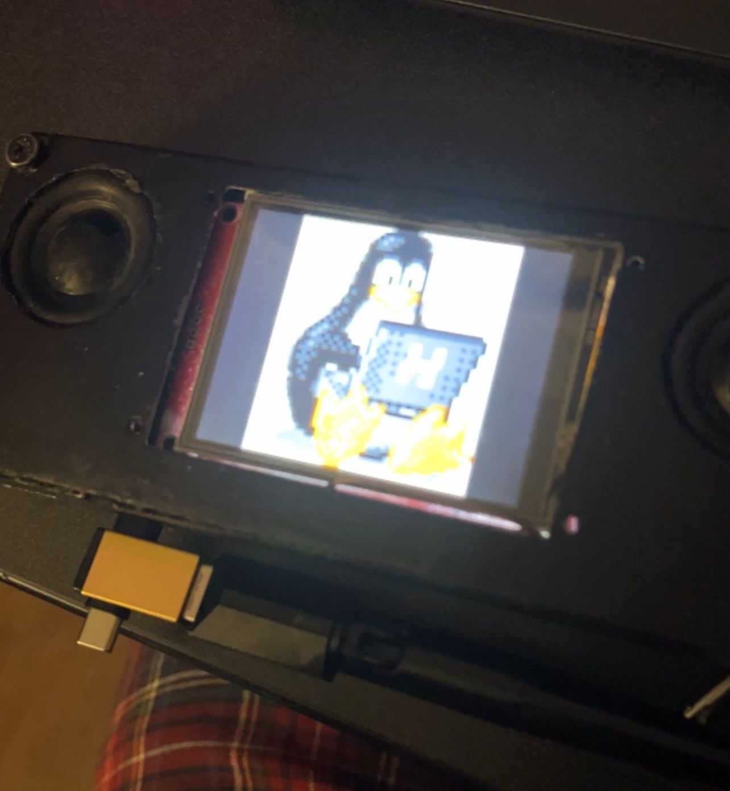<br/>
  <i>Art Mode in action — looping GIFs fullscreen through MPV.</i>
</p>

### Setup

Create a folder for your visuals:

```bash
mkdir /home/pi/GIFS
```

Add your `.gif` or `.mp4` files inside that folder.

Install MPV if not already installed:

```bash
sudo apt install mpv -y
```

### Script

Save this script as `/home/pi/artmode.sh`:

```bash
#!/bin/bash
mpv --loop-playlist --fullscreen /home/pi/GIFS/
```

Make it executable:

```bash
chmod +x /home/pi/artmode.sh
```

Run it anytime with:

```bash
./artmode.sh
```

### Auto-Start on Boot (optional)

To have Art Mode start automatically on boot, edit `/etc/rc.local` and add this line before `exit 0`:

```bash
/home/pi/artmode.sh &
```

This transforms the ScrapPi into a looping visual installation —
a low-power, always-on art display that runs entirely offline.

---


# Volumio Music Mode
  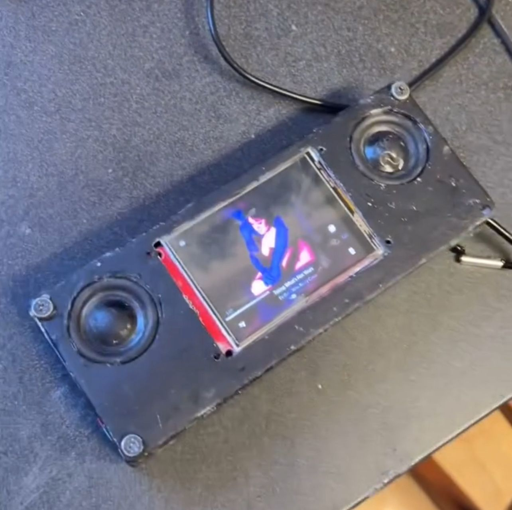<br/>
  <em>Standalone audio playback mode using ALSA and LightDM tweaks</em>
</p>

In this mode, the Pi boots directly into a clean music playback environment using **Volumio** and **ALSA**.  
Sound output is handled by a custom audio pipeline configured for low latency playback.

---

###  ALSA Configuration
Edit the system configuration files:

```bash
sudo nano /usr/share/alsa/alsa.conf
sudo nano /etc/asound.conf
```

entry:
```bash
pcm.!default {
  type hw
  card 0
}
ctl.!default {
  type hw
  card 0
}
```

### aplay Service Setup

Create a lightweight service to autostart playback on boot:

sudo nano /etc/systemd/system/aplay.service


Example service:
```bash
[Unit]
Description=ALSA Playback Service
After=sound.target

[Service]
ExecStart=/usr/bin/aplay /home/pi/Music/boot.wav
Restart=always

[Install]
WantedBy=multi-user.target
```

Enable it:
```bash
sudo systemctl enable aplay.service
```
### LightDM Autologin

Ensure LightDM logs in automatically to the music user session:
```bash
sudo nano /etc/lightdm/lightdm.conf
```

Set:
```bash
[Seat:*]
autologin-user=pi
autologin-session=lightdm-autostart
```

---


<h2 align="center"> RetroPie Mode</h2>
<p align="center">
  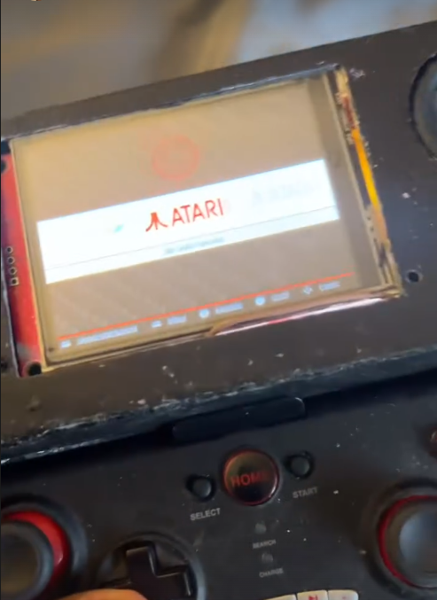
  <em>Classic gaming mode with full TFT display and audio support</em>
</p>

RetroPie Mode turns your Pi into a compact handheld console.  
This setup includes **TFT display drivers**, **I2S audio**, and **custom ALSA configuration** to make everything work seamlessly.

---

<h3>Setup Commands</h3>

```bash
sudo apt-get install cmake
git clone https://github.com/juj/fbcp-ili9341.git
cd fbcp-ili9341
sudo mkdir build
cd build
sudo cmake -DILI9341=ON -DGPIO_TFT_DATA_CONTROL=22 -DGPIO_TFT_RESET_PIN=27 -DSPI_BUS_CLOCK_DIVISOR=6 -DSTATISTICS=0 ..
sudo make -j
sudo ./fbcp-ili9341

sudo nano /etc/rc.local
sudo nano /boot/firmware/config.txt
sudo nano /boot/config.txt
sudo reboot
````

---

<h3>I2S Audio Setup</h3>

Install the Adafruit I2S AMP driver:

```bash
sudo apt install -y wget python3 python3-pip
wget https://github.com/adafruit/Raspberry-Pi-Installer-Scripts/raw/main/i2samp.py
sudo -E env PATH=$PATH python3 i2samp.py
sudo pip3 install adafruit-python-shell
```

Test and configure audio:

```bash
sudo alsamixer
speaker-test -c2 --test=wav -w /usr/share/sounds/alsa/Front_Center.wav
sudo raspi-config
sudo reboot
```

---

<h3>asound.conf</h3>

Edit `/etc/asound.conf` to include:

```conf
pcm.speakerbonnet {
   type hw card 0
}

pcm.dmixer {
   type dmix
   ipc_key 1024
   ipc_perm 0666
   slave {
     pcm "speakerbonnet"
     period_time 0
     period_size 1024
     buffer_size 8192
     rate 44100
     channels 2
   }
}

ctl.dmixer {
    type hw card 0
}

pcm.softvol {
    type softvol
    slave.pcm "dmixer"
    control.name "PCM"
    control.card 0
}

ctl.softvol {
    type hw card 0
}

pcm.!default {
    type             plug
    slave.pcm        "softvol"
}
```

---

<h3>Kernel Modules</h3>

Edit `/etc/modules` to include:

```conf
# /etc/modules: kernel modules to load at boot time.
#
# This file contains the names of kernel modules that should be loaded
# at boot time, one per line. Lines beginning with "#" are ignored.

uinput
```

---

<h3>Optional Service Management</h3>

Disable the aplay autostart service if present:

```bash
sudo systemctl disable aplay.service
sudo reboot
```

---

Perfect — here’s your **Desktop Environment** section, written in the same GitHub-ready format as the others (HTML-compatible, cleanly copy-pasteable, and stylistically consistent with your README layout).

---

<h2 align="center">Desktop Environment</h2>
<p align="center">
  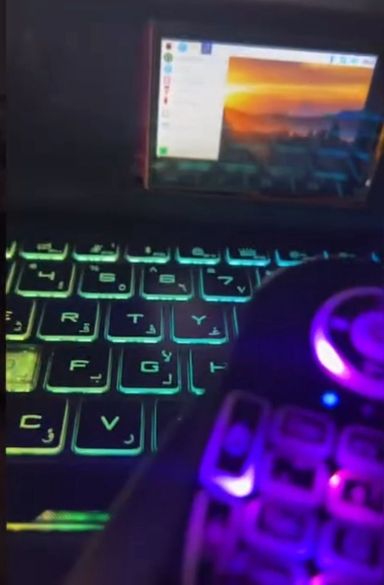<br/>
  <em>Running on a different image build — Raspbian Buster (Debian 10)</em>
</p>

This setup uses a **different image** than the RetroPie and Art modes.  
Here we’re working with **Raspbian GNU/Linux 10 (Buster)** — a lightweight desktop environment ideal for running graphical applications, music players, and Bluetooth connectivity for peripherals like keyboards or gamepads.

---

<h3> System Info</h3>

```bash
PRETTY_NAME="Raspbian GNU/Linux 10 (buster)"
NAME="Raspbian GNU/Linux"
VERSION_ID="10"
VERSION="10 (buster)"
VERSION_CODENAME=buster
ID=raspbian
ID_LIKE=debian
HOME_URL="http://www.raspbian.org/"
SUPPORT_URL="http://www.raspbian.org/RaspbianForums"
BUG_REPORT_URL="http://www.raspbian.org/RaspbianBugs"
````

---

<h3>Setup Commands</h3>

Below are the main setup commands used to configure the environment, display drivers, audio, and Bluetooth support.

```bash
sudo apt-get update
sudo apt-get install cmake
sudo git clone https://github.com/juj/fbcp-ili9341
cd fbcp-ili9341
sudo mkdir build
cd build
sudo cmake -DILI9341=ON -DGPIO_TFT_DATA_CONTROL=22 -DGPIO_TFT_RESET_PIN=27 -DSPI_BUS_CLOCK_DIVISOR=6 -DSTATISTICS=0 ..
sudo make -j

cd ~
sudo nano /etc/rc.local
sudo nano /boot/config.txt

sudo apt install python3-venv
sudo apt install -y wget
pip3 install adafruit-python-shell
wget https://github.com/adafruit/Raspberry-Pi-Installer-Scripts/raw/main/i2samp.py
sudo -E env PATH=$PATH python3 i2samp.py

sudo apt update
sudo apt install bluetooth bluez blueman -y
sudo systemctl start bluetooth
sudo systemctl enable bluetooth
bluetoothctl
alsamixer
bluetoothctl
sudo -E env PATH=$PATH python3 i2samp.py
```

---

<h3>🧩 Features Enabled</h3>

<ul>
  <li><strong>Display:</strong> TFT panel driven by <code>fbcp-ili9341</code> build.</li>
  <li><strong>Audio:</strong> I2S amplifier setup via Adafruit install script.</li>
  <li><strong>Bluetooth:</strong> Full Bluetooth stack (<code>bluetooth</code>, <code>bluez</code>, <code>blueman</code>) for wireless keyboards and gamepads.</li>
  <li><strong>Sound Control:</strong> Configurable through <code>alsamixer</code> for both internal and Bluetooth audio devices.</li>
  <li><strong>Desktop Use:</strong> Perfect for running Volumio, web browsers, file managers, and small utilities with minimal system load.</li>
</ul>

---

<p align="center">
  <em>The Desktop Mode gives the project a full workstation personality — for when you want the Pi to act like a computer again.</em>
</p>

---

<h2 align="center">Conclusion</h2>
<p align="center">
  <em>The ScrapPi — reborn as a modular experiment station.</em>
</p>

The build began as leftover boards and broken shells, but evolved into a set of living modes:  
RetroPie for play, Art Mode for motion, Oxide Mode for low-level exploration, and the Desktop for control.  
Each mode speaks to a different part of what the Raspberry Pi can become — a lab, a console, a canvas, or a companion.

This repository documents not just a configuration, but a process of reuse and curiosity.  
Every section here can be forked, remixed, or stripped down to serve your own project — whether that’s another handheld Pi build, a bench tester, or a pocket terminal.

> **Philosophy:** hardware ages, but experimentation doesn’t. Keep tinkering.

<p align="center">
  <em>For reference builds, see <a href="https://github.com/Echoras/angryoxide" target="_blank">Angry Oxide</a></em>
</p>

<p align="center">
  <strong>— End of Document —</strong><br/>
  <em>Maintained by Echoras</em>
</p>
